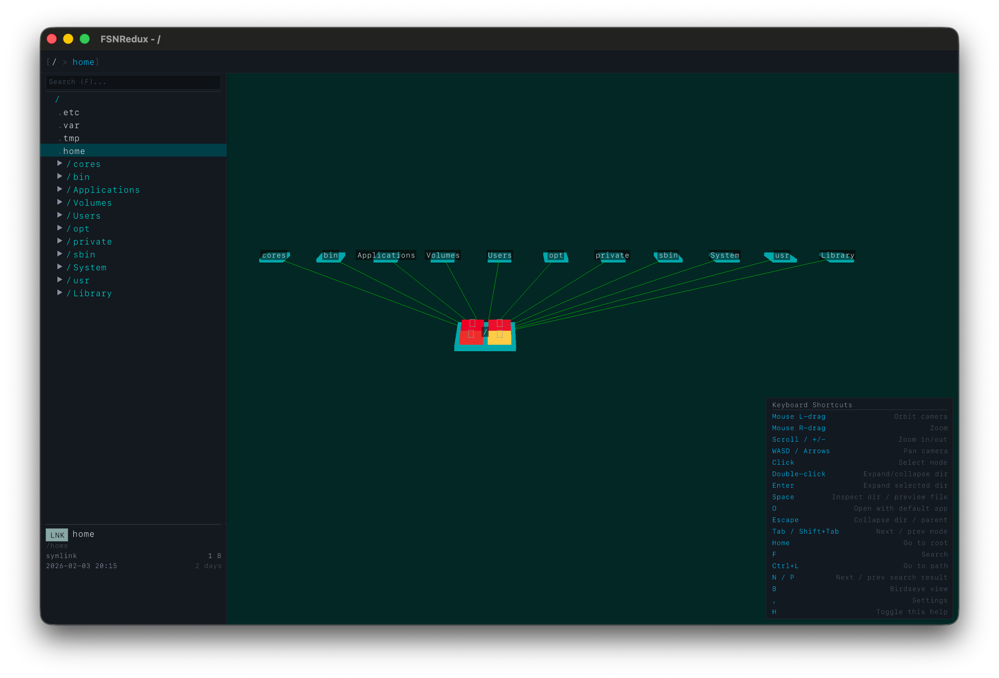
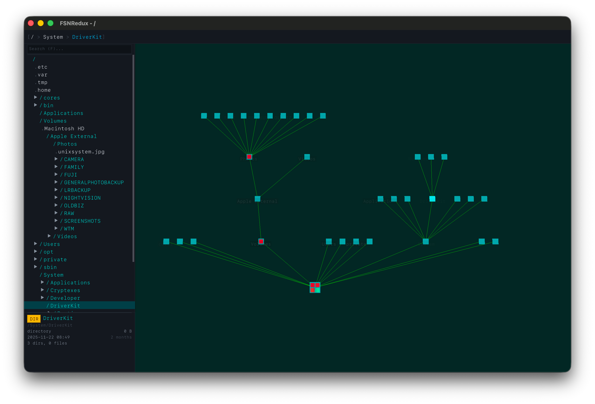
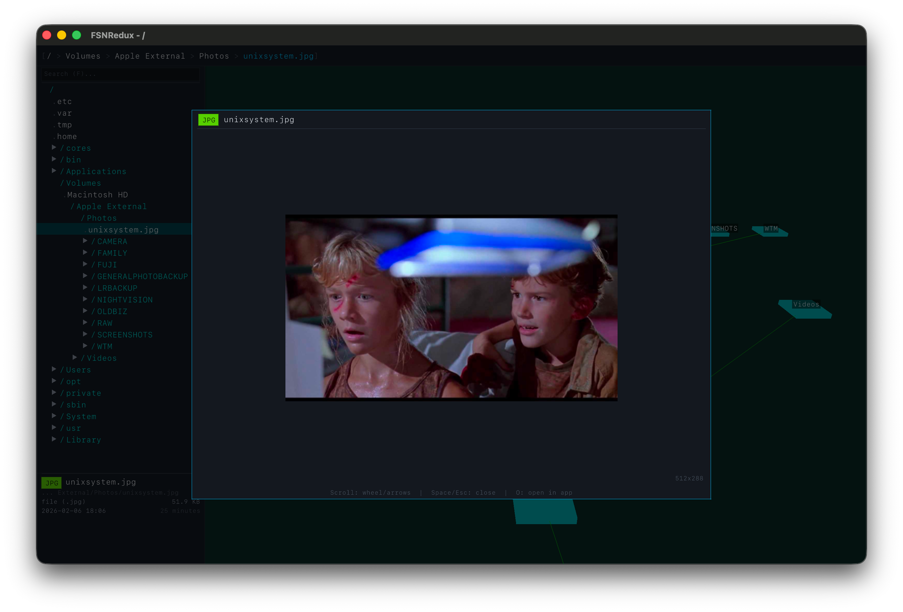

# FSNRedux

> 🦖 It's a UNIX system! I know this!

A 3D filesystem navigator inspired by the early 90s FSN program on SGI workstations (the same system Lex used in Jurassic Park). Built in Go with [raylib-go](https://github.com/gen2brain/raylib-go) for cross-platform 3D rendering.

Inspired by [jtsiomb/fsnav](https://github.com/jtsiomb/fsnav).

## About

FSNRedux visualizes your filesystem as an interactive 3D tree. Directories appear as boxes you can orbit, zoom, and navigate. Double-click to expand or collapse directories. The sidebar shows a tree view; the info panel shows details for the selected entry.

**Features:**
- 3D filesystem tree with age-based coloring
- File preview (text and images) on Space
- Inspect panel for directory metadata
- Open files with your default application (O)
- Birdseye view for an overhead layout of expanded directories
- Settings menu for theme, hidden files, and scan depth
- Customizable keybindings via `~/.config/fsnredux/keys.json`

## Screenshots

Root view at `/`:



Exploring Multiple Directories at Birdseye:



Image preview (Space on a file):



## Requirements

- [Go](https://go.dev/) 1.23 or later
- A C compiler (GCC, Clang, or MSVC)
- Platform: macOS, Linux, or Windows

**Linux:** Install raylib development libraries:

```bash
# Debian/Ubuntu
sudo apt install libxi-dev libxinerama-dev libxcursor-dev libxrandr-dev libgl1-mesa-dev libwayland-dev libxkbcommon-dev

# Fedora
sudo dnf install libXi-devel libXinerama-devel libXcursor-devel libXrandr-devel mesa-libGL-devel libwayland-dev libxkbcommon-devel
```

**macOS / Windows:** No extra packages needed; the Go toolchain and system SDKs are sufficient.

## Build

```bash
make build
```

The binary is written to `bin/fsnredux`.

## Run

```bash
./bin/fsnredux
```

By default, FSNRedux starts at the filesystem root (`/`). To start in a specific directory:

```bash
./bin/fsnredux -path /usr/local
```

### Options

| Flag | Default | Description |
|------|---------|-------------|
| `-path` | `/` | Root directory to visualize |
| `-width` | 1280 | Window width |
| `-height` | 800 | Window height |
| `-depth` | 5 | Maximum scan depth (0 = unlimited) |
| `-theme` | `auto` | Color theme: `dark`, `light`, or `auto` |
| `-hidden` | false | Show hidden files and directories |
| `-version` | - | Print version and exit |

## Controls

### Mouse

| Input | Action |
|-------|--------|
| Left-drag | Orbit camera |
| Right-drag | Zoom |
| Scroll | Zoom in/out |
| Click | Select node |
| Double-click | Expand/collapse directory |

### Keyboard

| Key | Action |
|-----|--------|
| W / Up | Pan forward |
| S / Down | Pan back |
| A / Left | Pan left |
| D / Right | Pan right |
| + / = / Numpad+ | Zoom in |
| - / Numpad- | Zoom out |
| Enter | Expand selected directory |
| Space | Inspect directory / preview file |
| O | Open with default application |
| Escape | Collapse directory or go to parent |
| Tab | Next node |
| Shift+Tab | Previous node |
| Home | Go to root |
| F | Search |
| Ctrl+L (Cmd+L on macOS) | Go to path |
| N | Next search result |
| P | Previous search result |
| B | Birdseye view |
| , (comma) | Settings |
| H | Toggle help |

Keybindings can be customized in `~/.config/fsnredux/keys.json`. The settings menu (,) lets you toggle hidden files, change theme (dark/light/auto), adjust scan depth, and show or hide the help legend.

## Project Structure

```
FSNRedux/
├── main.go           # CLI entry point
├── internal/
│   ├── app/          # Main application loop and wiring
│   ├── color/        # Theme and age-based coloring
│   ├── fs/           # Filesystem scanner and tree
│   ├── input/        # Camera, picker, keymap
│   ├── layout/       # 3D layout (tree, map views)
│   ├── renderer/     # 3D rendering
│   ├── scene/        # Scene graph
│   └── ui/           # Breadcrumb, sidebar, info panel, preview, settings
├── Makefile
└── go.mod
```

## Development

```bash
make test    # Run tests
make lint    # Run go vet
make clean   # Remove build artifacts
```

## License

This project is licensed under the MIT License. See [LICENSE](LICENSE) for details.
